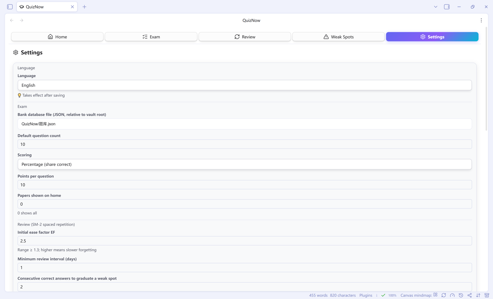

<div align="center">

# 🎓 QuizNow — Obsidian 快速考试与复习插件



**基于当前笔记一键生成考试试题 · 单选/多选/填空/判断 · SM-2 科学间隔复习**

[简体中文](README.md) | [English](README.en.md)

</div>

---

> **QuizNow** 是一个简洁、现代、轻量的 Obsidian 插件，帮助你在库内完成
> **「学习 → 考试 → 复习 → 巩固」** 的完整闭环：
> 从正在阅读的笔记生成试题 → 考试作答 → 错题自动进入 SM-2 间隔复习 →
> 反复答错的知识点进入「薄弱点」重点突破。

- ⚡ 纯原生 DOM 实现，无任何运行时框架，资源占用极低
- 🌍 界面支持 **简体中文 / English / 日本語 / 한국어** 四种语言
- 🗄️ 题库使用**单文件 JSON 数据库**存储，不再产生细碎文件，支持一键**备份/恢复**

---

## 📑 目录

- [功能特性](#-功能特性)
- [快速开始](#-快速开始)
- [使用指南](#-使用指南)
- [命令一览](#-命令一览)
- [题型与答题方式](#-题型与答题方式)
- [题库存储（单文件数据库）](#-题库存储单文件数据库)
- [数据备份与恢复](#-数据备份与恢复)
- [AI 生成（可选）](#-ai-生成可选)
- [多语言支持](#-多语言支持)
- [常见问题（FAQ）](#-常见问题faq)
- [开发](#-开发)
- [数据与隐私](#-数据与隐私)
- [许可证](#-许可证)

---

## ✨ 功能特性

| 板块 | 内容 |
| --- | --- |
| 🏠 **首页** | 第一栏：试题数量 / 错题数量 / 待复习数量 / 试卷数量统计卡；第二栏：每份试卷的**最高分**卡片（展示数量可在设置中调整） |
| 📝 **考试** | 闪卡式答题界面；单选/判断**点击即自动提交**，多选/填空手动提交；题目数量与题型自由设定；生成后可选「立即答题」或「加入题库」；答错的题自动入库并进入复习队列 |
| 🔄 **复习** | 考试答错的题自动汇总；按 **SM-2 间隔复习**算法重新答题（自评：忘记/困难/良好/简单）；**再次答错自动移入薄弱点** |
| 🎯 **薄弱点** | 反复答错、未真正理解的知识点集中管理；一键**生成解释**（AI 讲解或自动提取笔记上下文）帮助记忆；按 SM-2 对薄弱点出题重新作答，连续答对即自动移出 |
| ⚙️ **设置** | 题库数据库路径、默认出题数量、评分方式、题型组合、首页成绩卡数量、SM-2 参数、薄弱点掌握阈值、AI 接口、**自定义生成指令**、**界面语言**、**数据备份/恢复**等全局配置 |

**亮点速览**

- 📄 **文档右上角一键出题**：打开任意笔记，点击标题栏右上角的 📋 按钮即可生成试卷
- 🗄️ **单文件数据库**：全部题目集中存于 `QuizNow/题库.json`，随库同步、易于备份
- 💾 **一键备份/恢复**：导出全部数据（题库 + 记录 + 记忆进度 + 设置）为单个 JSON 文件
- 🤖 **AI 增强（可选）**：接入任意 OpenAI 兼容接口，AI 出题 + AI 讲解；未配置时使用零成本内置生成
- 🔧 **自定义生成指令**：多条 AI prompt 管理，可随时切换
- 🧠 **SM-2 科学复习**：经典间隔重复算法，自动安排每题的下次复习时间

---

## 🚀 快速开始

1. **下载插件**：将 `main.js`、`manifest.json`、`styles.css` 放入
   `<你的库>/.obsidian/plugins/obsidian-quiznow/` 目录（不存在则自建）；
2. **启用插件**：打开 Obsidian「设置 → 第三方插件」→ 启用 **QuizNow 快速考试与复习**；
3. **打开主面板**：点击左侧边栏的 🎓 图标，或命令面板执行
   `QuizNow：打开主面板`（主面板在**主内容区的新标签页**中打开，不使用侧栏）。

> 首次启动会自动创建示例题库数据库 `QuizNow/题库.json`（3 道示例题），
> 可在 Obsidian 中直接查看、修改或删除。

---

## 📖 使用指南

### 1. 从笔记生成试题

1. 打开一篇笔记 —— 重点术语用 `**加粗**` 标记，或使用「键: 值」形式的行，
   能显著提高内置生成的题目质量；
2. 点击文档**标题栏右上角的 📋 按钮**，或执行命令
   `QuizNow：基于当前笔记生成试题`；
3. 生成过程中会显示"正在生成试卷…"提示，完成后弹出预览窗口：
   - **立即答题** → 直接开始考试；
   - **加入题库** → 全部题目写入题库数据库 `QuizNow/题库.json`。

### 2. 考试

- 在「考试」标签中设置**题目数量**、**题型**（单选/多选/填空/判断）与
  **出题范围**（题库随机 / 薄弱点）；
- 单选、判断题**点击选项即自动提交**；多选需选完后点「提交答案」；
  填空可**回车提交**；
- 交卷后展示得分与错题回顾，**答错的题自动加入题库并进入复习队列**。

### 3. 复习（SM-2 间隔复习）

- 「复习」标签会列出**到期的错题**，以闪卡形式呈现：先回忆，点击卡片翻转查看答案；
- 自评记忆质量（忘记 / 困难 / 良好 / 简单），插件按 SM-2 算法安排下次复习时间；
- **再次答错 → 自动移入「薄弱点」**。

### 4. 薄弱点突破

- 进入「薄弱点」标签，对每个知识点点击 **✨ 生成解释** 帮助理解记忆；
- 点击 **🎯 薄弱点测试** 重新答题，连续答对（默认 2 次，可设置）即视为掌握并移出。

---

## ⌨️ 命令一览

| 命令 | 说明 |
| --- | --- |
| `QuizNow：打开主面板` | 打开插件主界面（新标签页） |
| `QuizNow：快速考试（题库随机抽题）` | 一键开始一场随机考试 |
| `QuizNow：基于当前笔记生成试题` | 根据当前打开的笔记生成试题 |
| 标题栏 📋 按钮 | 同上（文档标题栏右上角） |

---

## 🧩 题型与答题方式

| 题型 | 答题方式 | 判定说明 |
| --- | --- | --- |
| 单选 `single` | 点击选项即自动提交 | 唯一正确选项 |
| 多选 `multiple` | 勾选后点「提交答案」 | 必须与标准答案**完全一致** |
| 填空 `fill` | 输入后回车提交 | 大小写/空格不敏感，可接受多个答案 |
| 判断 `judge` | 点击 ✓正确 / ✗错误 即自动提交 | 对 / 错 |

---

## 🗄️ 题库存储（单文件数据库）

题库保存在**单个 JSON 数据库文件**中（默认 `QuizNow/题库.json`，可在设置中修改路径）。
所有题目集中存储，不再产生大量细碎的 Markdown 文件，随库同步、易于备份。

数据库文件结构：

```json
{
  "version": 1,
  "questions": [
    {
      "id": "unique-id",
      "type": "single | multiple | fill | judge",
      "content": "法国的首都是哪里？",
      "options": ["伦敦", "巴黎", "柏林", "罗马"],
      "answer": ["B"],
      "explanation": "巴黎是法国的首都",
      "source": "我的笔记",
      "createdAt": 1720000000000
    }
  ]
}
```

> **升级提示**：从旧版本升级时，原 `QuizNow/题库/` 文件夹中的 Markdown 题目文件
> 会自动迁移进数据库文件（原文件夹保留，可手动删除）。

---

## 💾 数据备份与恢复

在「设置 → 数据备份」中：

- **立即备份**：把题库、考试记录、SM-2 记忆进度与全部设置导出为一个
  `quiznow-backup-时间戳.json` 文件（默认存放于 `QuizNow/backups/`）；
- **恢复**：从备份列表中任选一份恢复（**恢复前会自动先备份当前数据**，防止误操作丢失）；
- 备份文件可随时复制到其它设备，恢复后完整还原插件状态。

---

## 🤖 AI 生成（可选）

在「设置」中填写 OpenAI 兼容接口（如 OpenAI / DeepSeek / 通义千问 / 本地 Ollama 等）：

- **API 地址**：`https://api.openai.com/v1`（或其兼容地址）
- **API 密钥**、**模型**、**每次生成数量**
- 勾选「启用 AI 生成试题与解释」后：
  - 「基于当前笔记生成试题」将调用 AI 出题（失败自动回退内置生成）；
  - 「薄弱点」的「生成解释」将调用 AI 通俗讲解。

**自定义生成指令**：在「设置 → 自定义生成指令」中可新增 / 删除多条自定义
AI 指令（prompt），并选择当前使用哪一条；不选择时使用内置的多语言系统默认指令。
指令文本中可使用 `{count}`（生成数量）与 `{types}`（启用的题型）两个占位符。

> 未配置 AI 时，插件使用**零成本的内置启发式生成**：
> 加粗术语 → 填空/单选，键值对 → 填空。

---

## 🌍 多语言支持

在「设置 → 界面语言」中选择 **简体中文 / English / 日本語 / 한국어**，
保存后整个插件界面（含命令名、提示、通知、AI 默认指令）即切换语言。

---

## ❓ 常见问题（FAQ）

**Q：为什么题库是一个 JSON 文件，而不是很多 Markdown 文件？**
A：单文件数据库避免每次生成产生大量细碎文件，且随库同步、备份、迁移都更简单；
功能上（生成 → 加入题库 → 抽题 → 复习）与旧版完全一致。

**Q：升级后我原来的题目还在吗？**
A：在。旧版 `QuizNow/题库/` 文件夹中的题目会自动迁移到 `QuizNow/题库.json`，
迁移完成后原文件夹可手动删除。

**Q：没有 AI 密钥可以使用吗？**
A：可以。未配置 AI 时使用内置的启发式生成（加粗术语 → 填空/单选，键值对 → 填空），
并可从笔记自动提取薄弱点的上下文解释。

**Q：如何把数据搬到另一台电脑？**
A：在旧设备「设置 → 数据备份 → 立即备份」，把生成的备份 JSON 文件复制到新设备，
在新设备安装插件后「设置 → 数据备份 → 恢复」即可。

**Q：数据保存在哪里？卸载插件会丢失吗？**
A：数据保存在插件 `data.json` 与题库数据库文件（`QuizNow/题库.json`）中，
**卸载插件不会删除这些文件**，重新安装后自动读取。

---

## 🛠 开发

```bash
npm install
npm run dev        # 监听模式，输出 main.js
npm run build      # 类型检查 + 生产构建
```

| 模块 | 说明 |
| --- | --- |
| `src/main.ts` | 插件入口：命令、Ribbon、标题栏按钮、视图注册 |
| `src/store.ts` | 数据持久化、题库数据库（单文件 JSON）、备份/恢复 |
| `src/types.ts` | 数据模型与设置项 |
| `src/question.ts` | 题目格式解析 / 序列化 / 答案判定 |
| `src/generator.ts` | 内置启发式出题与解释提取 |
| `src/ai.ts` | OpenAI 兼容 AI 客户端 |
| `src/sm2.ts` | SM-2 间隔复习算法 |
| `src/i18n.ts` | 中 / 英 / 日 / 韩四语言国际化 |
| `src/views/` | 首页 / 考试 / 复习 / 薄弱点 / 设置五个视图 |

---

## 🔒 数据与隐私

- 所有数据**仅保存在本地库内**（插件 `data.json` + 题库数据库文件），不上传任何服务器；
- AI 功能仅在**你主动点击生成**时才将当前笔记内容发送到你配置的 API 地址；
- 请自行评估所配置的第三方 AI 服务的数据使用政策。

---

## 📄 许可证

[MIT](LICENSE) © QuizNow

---

<div align="center">

**QuizNow** — 让 Obsidian 成为你的私人考场 📝

</div>
